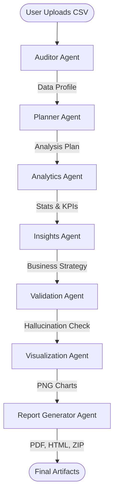
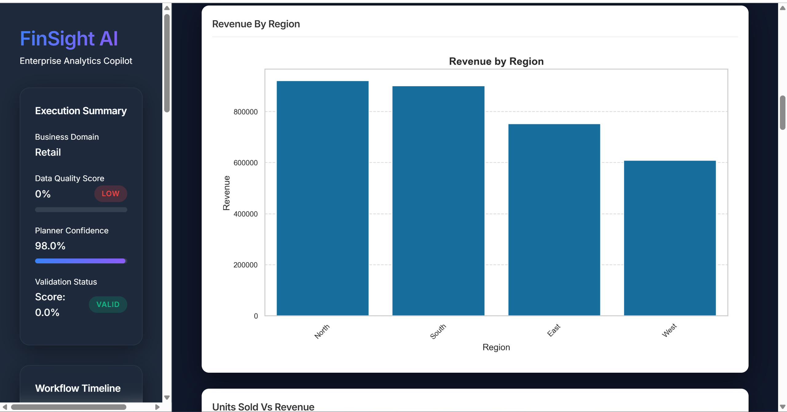
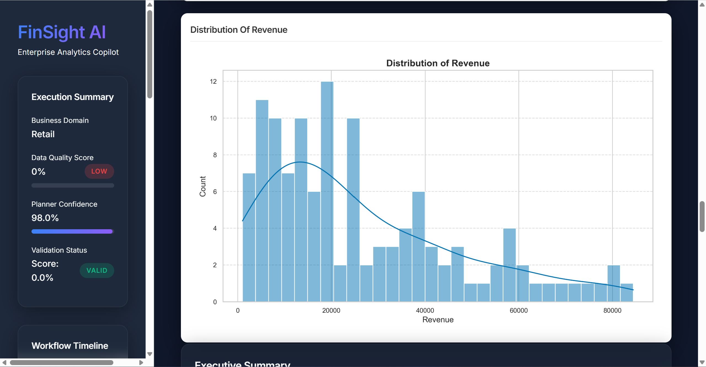
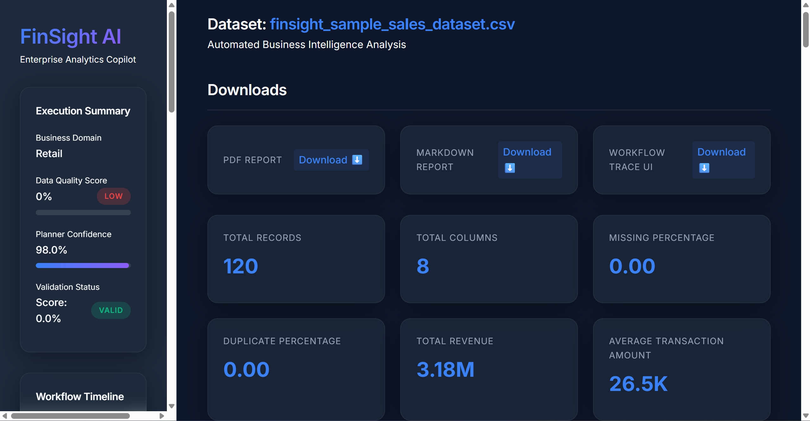
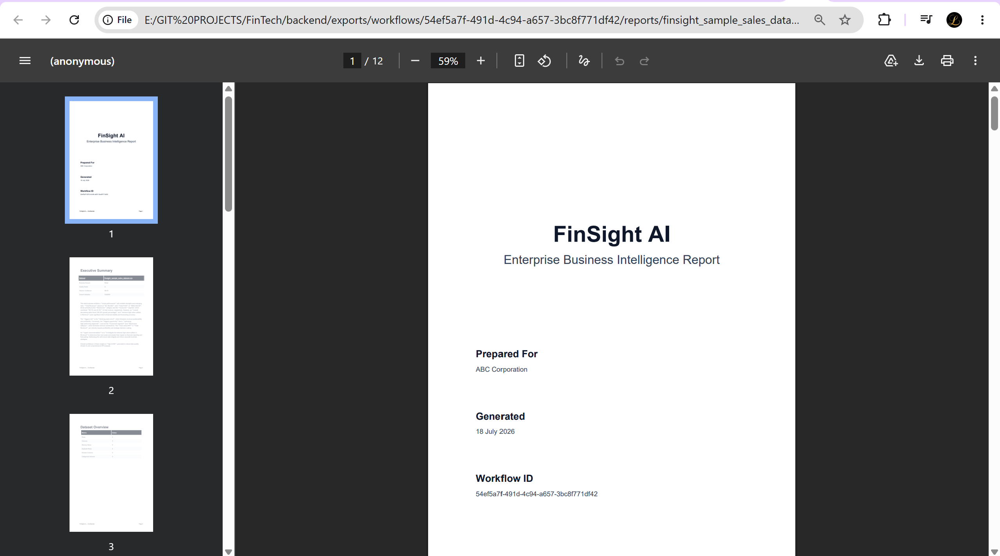
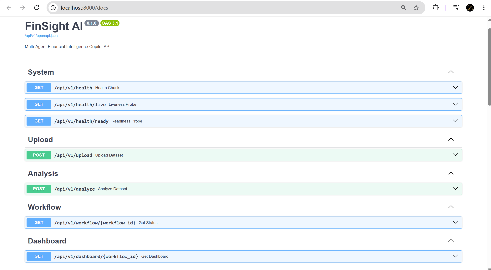

<div align="center">

# 🚀 FinSight AI
### Enterprise-Grade Multi-Agent Business Intelligence Copilot

[](https://python.org)
[](https://fastapi.tiangolo.com)
[](https://langchain-ai.github.io/langgraph/)
[](https://opensource.org/licenses/MIT)

*Transform raw data into executive insights instantly.*

</div>

<hr/>

## 📖 Overview

**FinSight AI** is a backend-first, API-first enterprise AI platform designed to automate the work of a junior data analyst and business consultant. 

By uploading a simple CSV dataset, FinSight orchestrates a deterministic swarm of LLM-powered agents to audit data quality, generate business metrics, identify trends, detect anomalies, visualize findings, and author a publication-ready PDF report—all completely autonomously. 

## ⚡ Why FinSight AI?

In modern enterprises, data analysis is fragmented across tools (Excel, Python, Tableau, PowerPoint) and prone to human error. FinSight solves this by unifying the pipeline. It doesn't just process data; it **reasons** about it. It creates its own analytical plan, validates its own hallucinated findings, and packages everything into beautiful, boardroom-ready deliverables.

## ✨ Core Features

- 🧠 **Dynamic Planner**: Analyzes the dataset schema to autonomously construct a custom multi-step analytical plan tailored to the specific business domain.
- 📊 **Business Analytics Engine**: Computes dataset profiles, correlation matrices, KPI breakdowns, segmentation models, and time-series trends using vectorized Pandas operations.
- 💡 **AI Insights Agent**: Interprets the raw statistical outputs to generate strategic business risks, actionable opportunities, and executive summaries.
- 🛡️ **Validation Agent**: Mathematically scores every generated insight against the source data, eliminating LLM hallucinations with strict evidence-based grading.
- 📈 **Visualization Agent**: Automatically renders and exports matplotlib-based PNG charts relevant to the detected trends.
- 📄 **Executive PDF Engine**: Uses native ReportLab to compile a pristine, consulting-grade PDF deliverable without fragile HTML-to-PDF dependencies.
- 🖥️ **Enterprise Dashboard**: Generates a standalone, dependency-free `Dashboard.html` file embedded with KPI cards, charts, and interactive tabs.
- 📦 **Artifact Packaging**: Seamlessly bundles all generated CSVs, JSONs, PNGs, Markdown, and PDFs into a single downloadable `FinSight_Report.zip` archive.
- ⏱️ **Evaluation Framework**: Includes a bulk CI/CD benchmarking script that processes multiple datasets to calculate success rates, token usage, and hallucination scores.
- 🔍 **Explainability & Trace Viewer**: Exports deterministic `agent_trace.json` graphs and a beautiful HTML UI to audit exactly how the agents routed data and consumed tokens.

## 🏗️ Architecture

FinSight operates on a deterministic State Graph architecture using LangGraph. Each agent mutates a globally typed `FinSightState`.



## 📸 Screenshots

### 1. Analysis Charts



### 2. Executive Dashboard


### 3. PDF Consulting Report


### 4. Interactive OpenAPI Swagger


## 🤖 Agent Pipeline

1. **Auditor Agent**: Inspects the raw CSV, imputes missing values, and establishes the "Business Domain" (e.g., Retail, Finance, Healthcare).
2. **Planner Agent**: Acts as the project manager. Reads the Auditor's findings and generates a strict, JSON-enforced roadmap of necessary calculations.
3. **Analytics Agent**: Executes the roadmap. Handles heavy-duty Pandas aggregations, standard deviations, and grouping.
4. **Insights Agent**: The "Consultant". Translates raw numbers into human-readable strategic text and executive summaries.
5. **Validation Agent**: The "Fact-Checker". Ranks each insight against the original dataframe. If an insight claims sales rose 20% but the data says 15%, it flags it.
6. **Visualization Agent**: Identifies the most critical data structures and renders appropriate charts (Bar, Line, Scatter, Pie).
7. **Report Agent**: The final packager. Triggers the PDF Engine, the Dashboard Builder, the Trace Viewer, and the Artifact Packager.

## 📁 Folder Structure

```text
FinTech/
├── backend/
│   ├── agents/           # LangGraph Agent Nodes
│   ├── api/              # FastAPI Routers & Endpoints
│   ├── config/           # Pydantic Settings & Environment
│   ├── dashboard/        # Legacy (Migrated to reporting)
│   ├── evaluation/       # CI/CD Benchmarking Framework
│   ├── exports/          # Generated Output Artifacts
│   ├── graph/            # LangGraph Workflow Orchestrator
│   ├── reporting/        # PDF, Dashboard, Package, Trace Engines
│   ├── services/         # LLM Gateways & Artifact Managers
│   ├── state/            # TypedDict State Definitions
│   └── utils/            # Telemetry, Logging, Cache
├── finsight_sample_...   # Example Datasets
├── main.py               # FastAPI Entrypoint
└── requirements.txt
```

## 🚀 Installation

1. **Clone the repository**
   ```bash
   git clone https://github.com/yourusername/FinSight-AI.git
   cd FinSight-AI
   ```

2. **Create a virtual environment**
   ```bash
   python -m venv venv
   source venv/bin/activate  # On Windows: venv\Scripts\activate
   ```

3. **Install dependencies**
   ```bash
   pip install -r requirements.txt
   ```

## ⚙️ Environment Variables

Create a `.env` file in the root directory:

```env
GEMINI_API_KEY=your_google_gemini_api_key
ENVIRONMENT=development
LOG_LEVEL=INFO
EXPORTS_DIR=backend/exports
```

## 🏃 Running the Project

Start the FastAPI backend server:

```bash
uvicorn main:app --reload
```

The server will be available at `http://localhost:8000`.
Explore the interactive Swagger documentation at `http://localhost:8000/docs`.

## 🌐 API Endpoints

- `GET /health` : System health check.
- `POST /api/v1/upload` : Upload a CSV dataset.
- `POST /api/v1/analyze` : Start the LangGraph execution.
- `GET /api/v1/workflow/{id}` : Check execution status.
- `GET /api/v1/dashboard/{id}` : Retrieve dashboard metadata.
- `GET /api/v1/analytics/{id}` : Retrieve raw JSON analytics.
- `GET /api/v1/validation/{id}` : Retrieve fact-checking scores.
- `GET /api/v1/reports/{id}` : Retrieve generated paths.
- `GET /api/v1/downloads/all/{id}` : Download the complete ZIP archive.

## 📊 Example Outputs

When a workflow completes, all artifacts are safely isolated in `backend/exports/workflows/<workflow_id>/`. You will receive:

- **PDF**: A professionally formatted executive document.
- **Dashboard**: A sleek, standalone HTML file displaying KPI cards and embedded charts.
- **Trace UI**: A standalone HTML file mapping out the exact LLM execution path and token costs.
- **Charts**: High-resolution PNGs.
- **ZIP**: Everything packaged perfectly for distribution.

## 📈 Performance & Benchmarking

To run the Evaluation Framework across multiple datasets:

```bash
python -m backend.evaluation.benchmark
```
This generates `benchmark_results.csv` and a ranked `leaderboard.json` to ensure code changes don't degrade the hallucination scores or LLM latency.

## 🔮 Future Improvements

- Add asynchronous streaming of agent status to the API (Server-Sent Events).
- Expand supported data sources (SQL, Snowflake, BigQuery).
- Implement OpenTelemetry for native LangSmith/DataDog integration.

## 📄 License

This project is licensed under the MIT License - see the LICENSE file for details.
