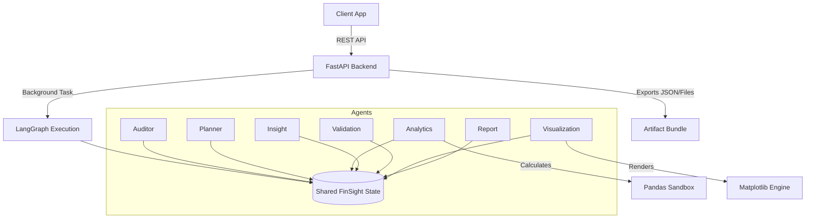

# System Architecture

FinSight AI is designed as a backend-first, API-driven enterprise AI platform. Instead of a monolithic LLM call, it utilizes a multi-agent state machine implemented in **LangGraph**.

## Core Components

1. **FastAPI Layer (`backend/api/`)**
   - Exposes RESTful endpoints for uploading datasets, starting analyses, and polling status.
   - Pydantic models strictly validate all incoming and outgoing JSON schemas.
   - Background tasks manage the asynchronous execution of LangGraph so the API remains responsive.

2. **LangGraph Orchestrator (`backend/graph/`)**
   - The central nervous system of FinSight AI.
   - It maintains a shared `FinSightState` (TypedDict) which acts as the memory for the entire workflow.
   - Edges in the graph determine conditional routing (e.g., if Validation fails, it routes back to Analytics or stops).

3. **Intelligence Nodes (`backend/agents/`)**
   - 7 modular agents that perform distinct tasks.
   - These agents do not communicate directly with each other; they only read from and write to the shared `FinSightState`.

4. **Deterministic Sandbox**
   - LLMs are prone to hallucination when performing math. FinSight explicitly forbids LLMs from performing numerical calculations.
   - The **Analytics Agent** relies strictly on Pandas and NumPy to compute standard deviations, trends, and aggregations.
   - The LLMs (Planner, Insight, Report) are only allowed to reason over the JSON outputs of the deterministic sandbox.

## Component Diagram

## Shared State Architecture
The `FinSightState` is passed sequentially through the graph. Key components include:
- `dataset_info`: File metadata and the raw Pandas DataFrame.
- `workflow_tracking`: The Planner's step-by-step reasoning and current node progression.
- `business_analytics`: The pure, mathematically calculated KPIs.
- `ai_insights`: The narrative explanations generated by the LLM.
- `execution_metadata`: Telemetry for tokens, latency, and costs.
