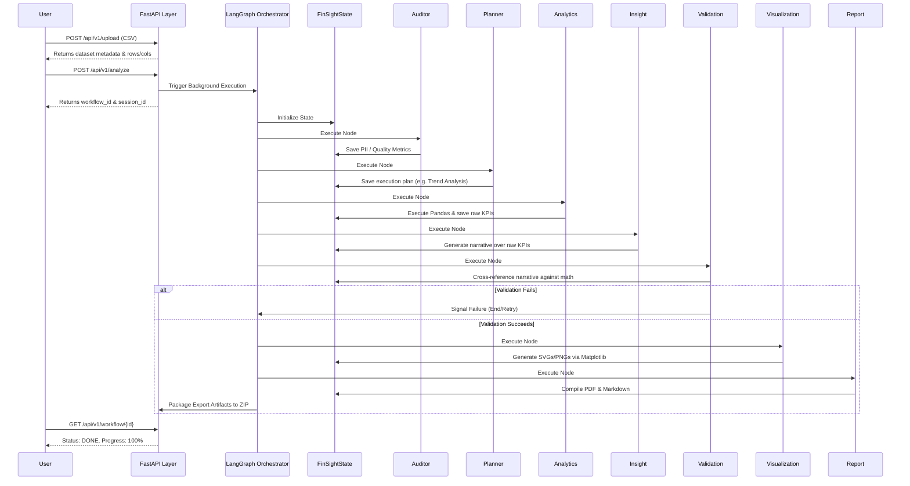

# Workflow Sequence

This sequence diagram illustrates the lifecycle of a dataset from upload to the final generated artifact bundle.

## End-to-End Execution Flow

```mermaid
sequenceDiagram
    participant User
    participant API as FastAPI Layer
    participant Graph as LangGraph Orchestrator
    participant State as FinSightState
    participant Auditor
    participant Planner
    participant Analytics
    participant Insight
    participant Validation
    participant Viz as Visualization
    participant Report

    User->>API: POST /api/v1/upload (CSV)
    API-->>User: Returns dataset metadata & rows/cols

    User->>API: POST /api/v1/analyze
    API->>Graph: Trigger Background Execution
    API-->>User: Returns workflow_id & session_id
    
    Graph->>State: Initialize State
    
    Graph->>Auditor: Execute Node
    Auditor->>State: Save PII / Quality Metrics
    
    Graph->>Planner: Execute Node
    Planner->>State: Save execution plan (e.g. Trend Analysis)
    
    Graph->>Analytics: Execute Node
    Analytics->>State: Execute Pandas & save raw KPIs
    
    Graph->>Insight: Execute Node
    Insight->>State: Generate narrative over raw KPIs
    
    Graph->>Validation: Execute Node
    Validation->>State: Cross-reference narrative against math
    
    alt Validation Fails
        Validation->>Graph: Signal Failure (End/Retry)
    else Validation Succeeds
        Graph->>Viz: Execute Node
        Viz->>State: Generate SVGs/PNGs via Matplotlib
        
        Graph->>Report: Execute Node
        Report->>State: Compile PDF & Markdown
        
        Graph->>API: Package Export Artifacts to ZIP
    end
    
    User->>API: GET /api/v1/workflow/{id}
    API-->>User: Status: DONE, Progress: 100%
```
